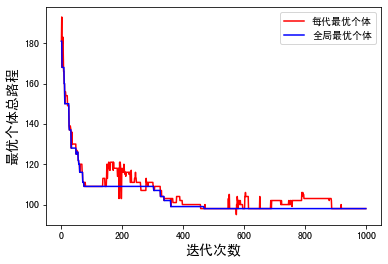
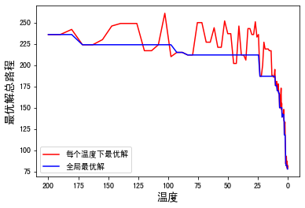
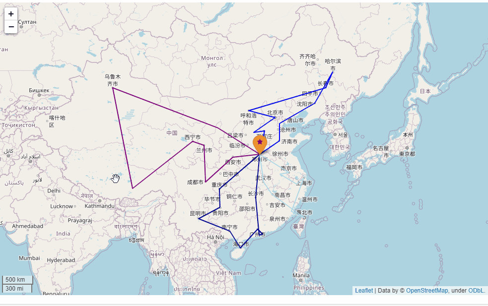
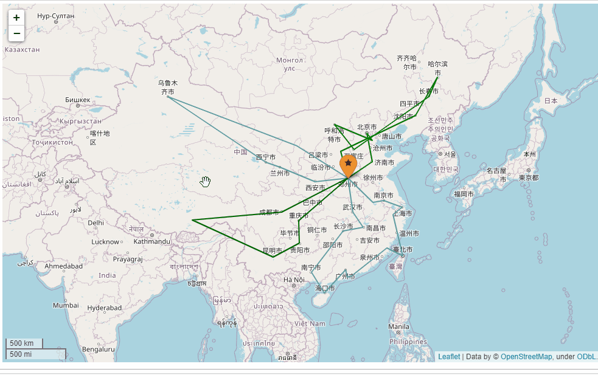

## 基于遗传算法和模拟退火算法的多旅行商问题(MTSP)研究

本项目分别实现了遗传算法（GA）和模拟退火算法（SA）解决多旅行商问题。多旅行问题分为两个实际的问题场景，分别对应于本项目的两个实验。第一个实验是工厂安排巡检路线问题，数据见`data/routine_nodes.txt`；第二个实验是安排运输机航线问题，数据见`data/provincial_capital.txt`。最后两个实验的可视化结果保存在`mtsp_ga_and_sa.ipynb`中。

### 实验环境

* python  3.6
* matplotlib  3.3.0
* folium  0.11.0

### 目录结构

```
├── README.md 
├── utils.py
├── genetic_algorithm.py
├── simulated_annealing.py
├── mtsp_ga_and_sa.ipynb
├── data
	├── routine_nodes.txt
	├── provincial_capital.txt
├── imgs
└── ariline
	├── ga_best_all_air_line.html
	├── sa_best_all_air_line.html
```

文件功能描述：

| 文件                                                         | 描述                                                         |
| ------------------------------------------------------------ | ------------------------------------------------------------ |
| utils.py                                                     | 工具模块，包含读取文件功能                                   |
| genetic_algorithm.py                                         | 遗传算法模块                                                 |
| simulated_annealing.py                                       | 模拟退火算法模块                                             |
| [mtsp_ga_and_sa.ipynb](mtsp_ga_and_sa.ipynb)                 | 实验一和二分别使用GA和SA，保存结果并进行可视化展示           |
| [routine_nodes.txt](./data/routine_nodes.txt)                | 实验一数据：26个节点之间的路程<br>如：第二行"2	3	1"表示检查点2到检查点3距离为1 |
| [provincial_capital.txt](./data/provincial_capital.txt)      | 实验二数据：中国34个城市的经纬度<br>如："北京	116.407526	39.90403"中第一个数字为北京经度，第二个数字为北京纬度 |
| [ga_best_all_air_line.html](./airline/ga_best_all_air_line.html) | GA安排所有运输机航线结果(加载需要花费一定时间)               |
| [sa_best_all_air_line.html](./airline/sa_best_all_air_line.html) | SA安排所有运输机航线结果(加载需要花费一定时间)               |

### 实验结果

实验一和实验二的结果都显示在`mtsp_ga_and_sa.ipynb`中，如果想重新程序，只要运行`mtsp_ga_and_sa.ipynb`即可。

#### 实验一：工厂安排巡检路线问题(26个检查点)

##### GA结果



##### SA结果



#### 实验二：安排运输机航线问题(中国34个城市)

##### GA结果

GA同样的有上述总路程分析图，但是增加了运输机航线可视化路线。



##### SA结果

